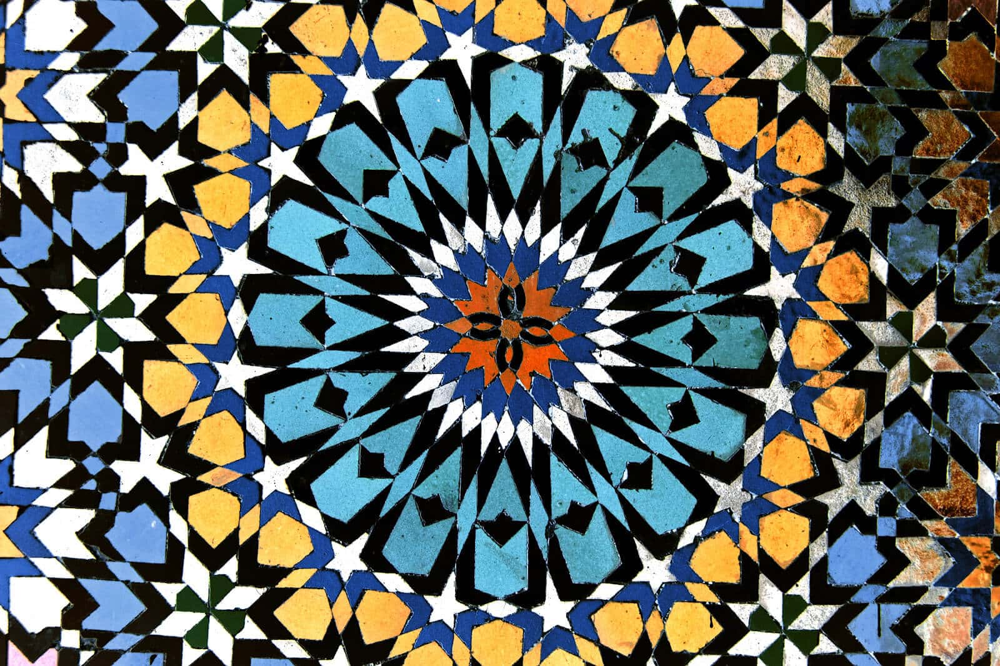
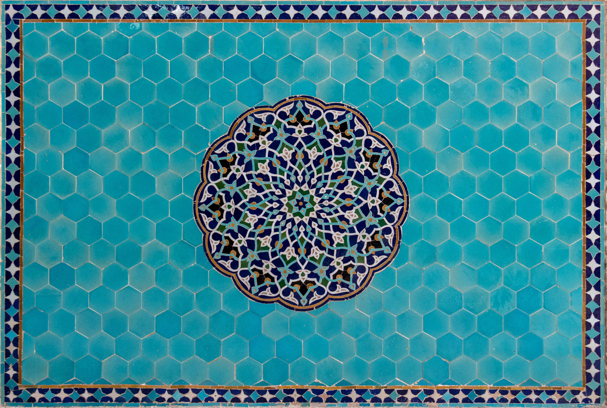
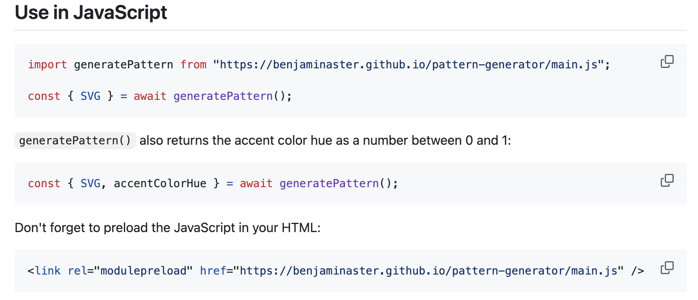
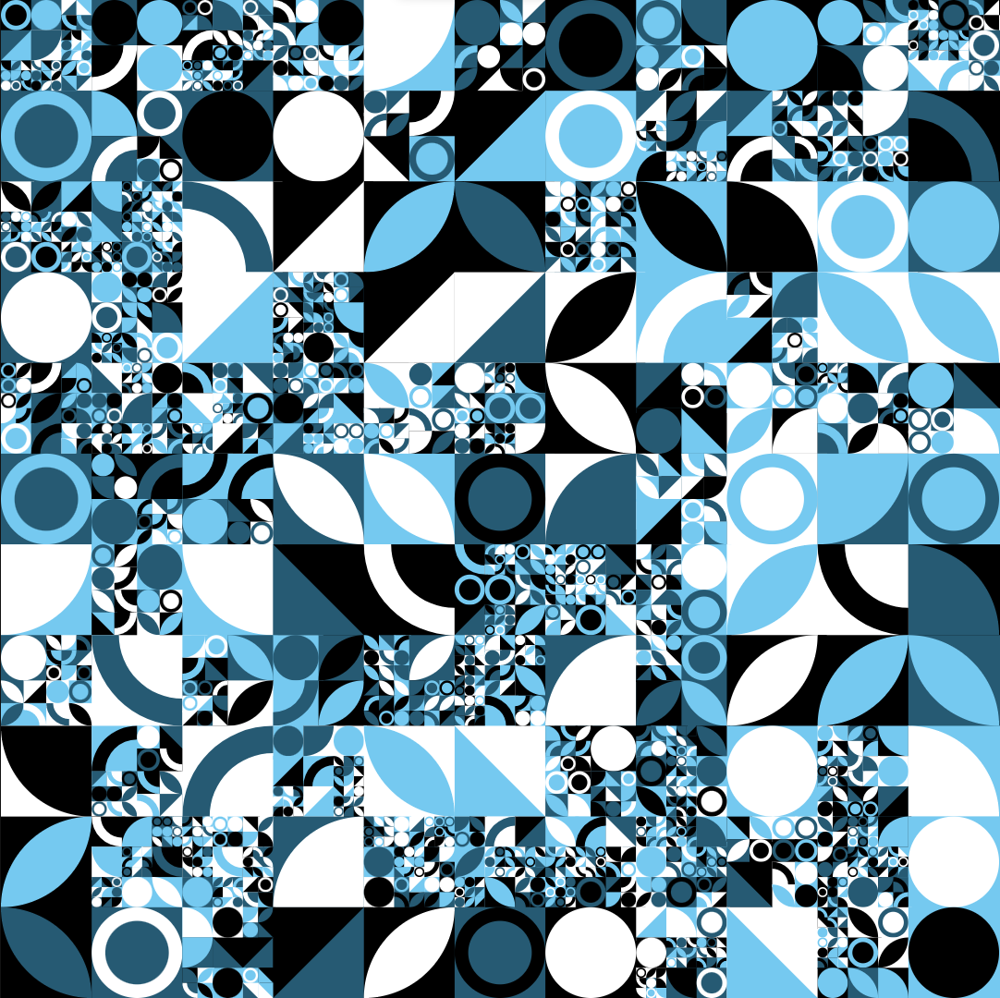
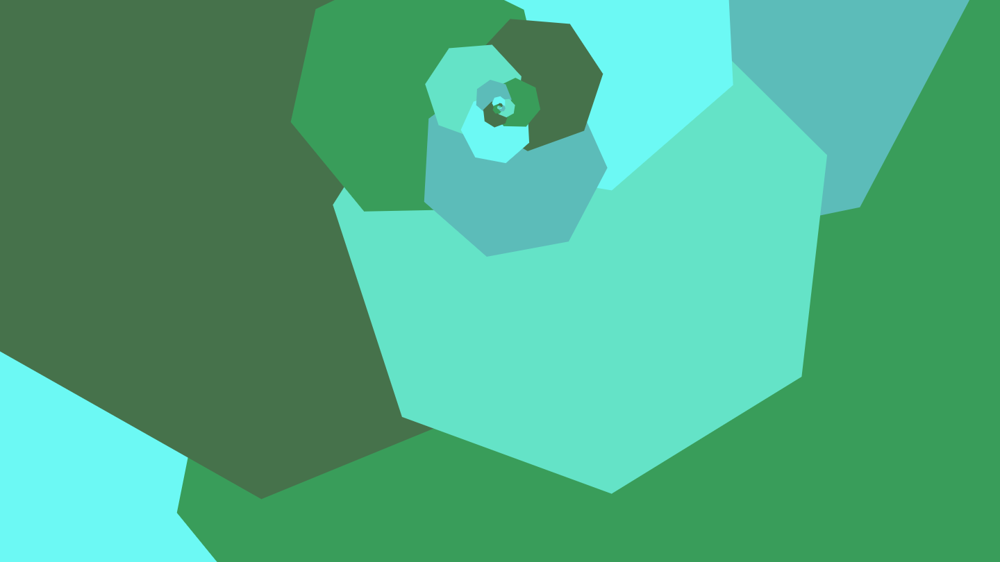

# clin0357_9103_tut3

## Part 1
For my project, I find generative art particularly inspiring, especially the intricate geometric designs seen in Islamic tile patterns. These patterns are mesmerizing due to their symmetry, repetition, and mathematical precision. The aspect I'd like to incorporate is the recursive pattern creation, where small shapes repeat to form a larger, cohesive design. This approach would add visual complexity to my project while maintaining order and harmony.

- Example picture 1

- Example picture 2

## Part 2
A useful coding technique to achieve the desired effect is recursive functions. These functions allow shapes to be drawn repeatedly in a pattern by calling themselves within loops, making them ideal for generating geometric designs like tile patterns. Using recursion in combination with JavaScript and canvas manipulation (e.g., p5.js or WebGL) can help achieve the symmetry and precision required for this project. 

- Example code

- Example picture 3

- Example link
[Link Text ](https://paralogia.github.io/dessin/)

- Example picture 4

