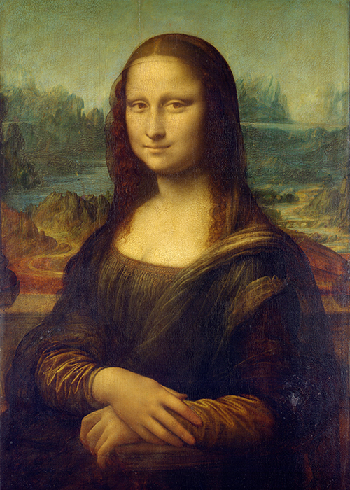

# clin0357_9103_tut3

This is my first push to github.

# heading 1
## heading 2
### heading 3
#### heading 4
##### heading 5
###### heading 6

**bold**
*Italics*

- item 1
- item 2
    - subitem 1
    - subitem 2

1. ordered thing
2. ordered thing 2

[Link Text](https://www.google.com)

